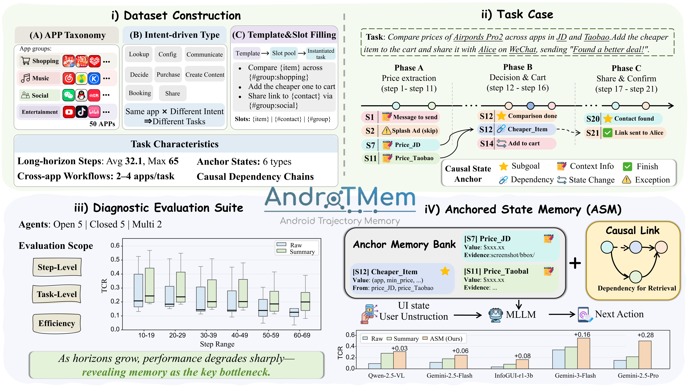
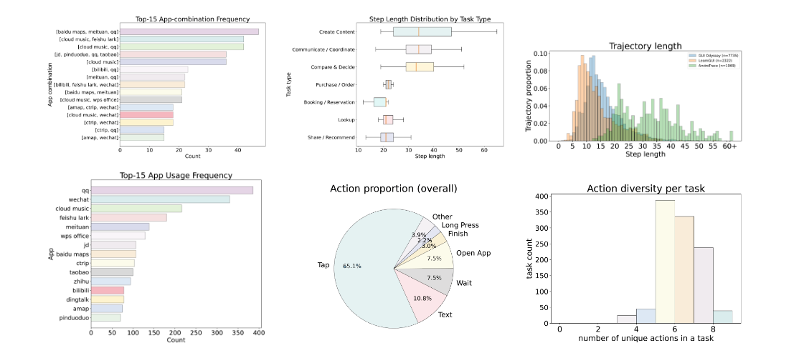
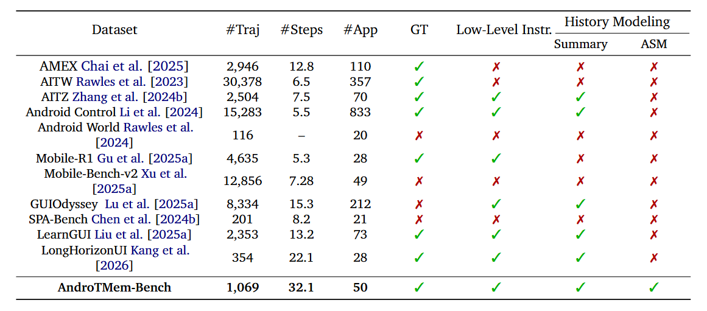
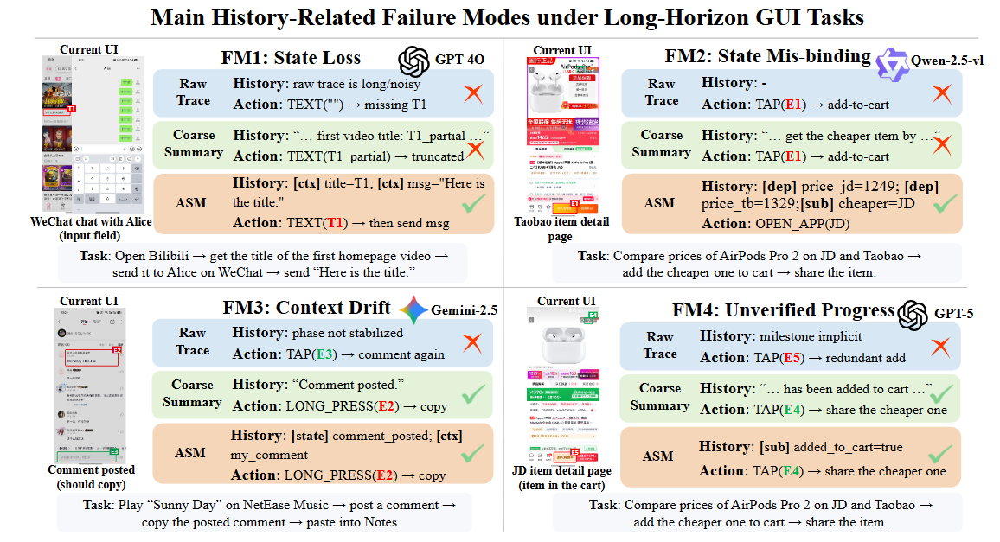
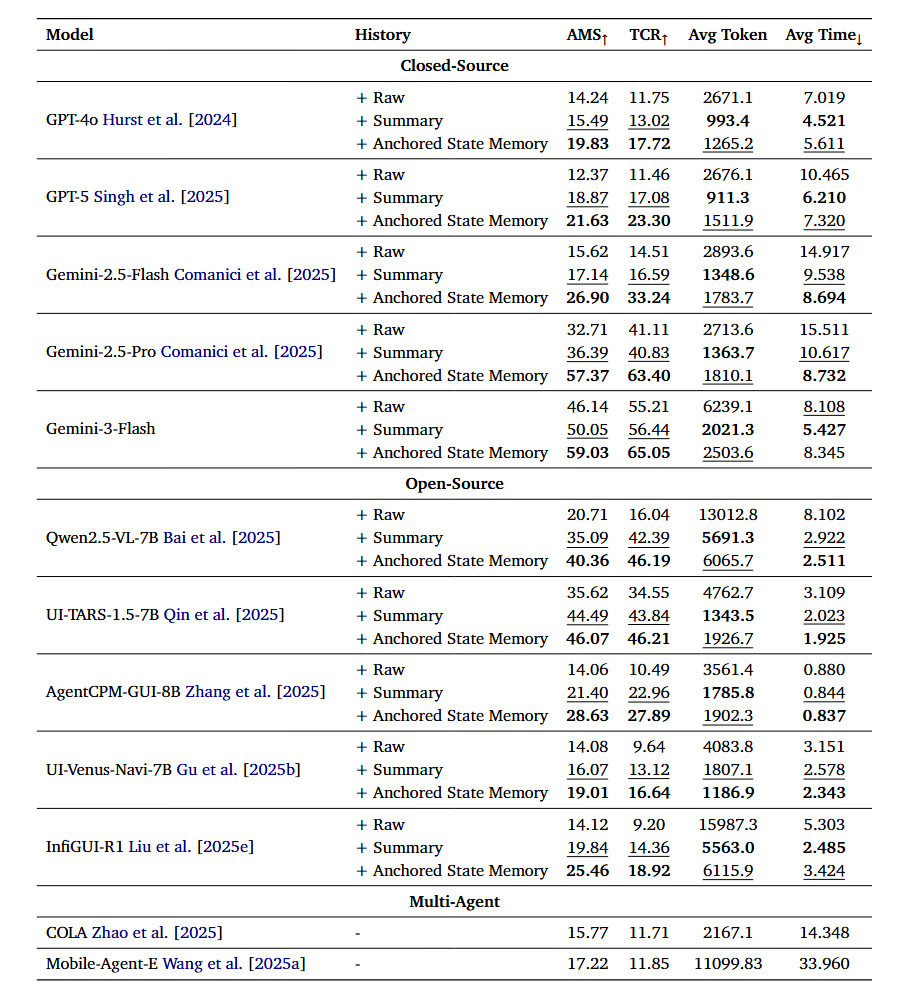
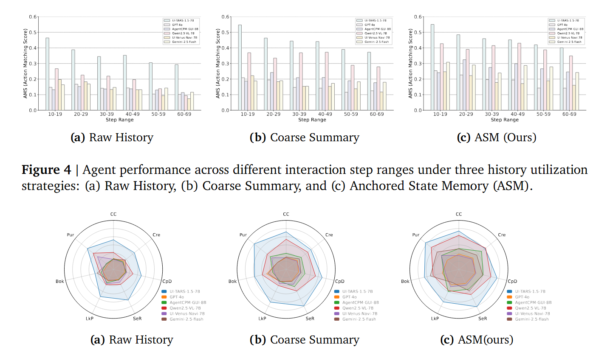

# AndroTMem: From Interaction Trajectories to Anchored Memory in Long-Horizon GUI Agents


<div align="center">
<p align="center">
&nbsp&nbsp📑 <a href="https://arxiv.org/abs/2603.18429"><b>Paper</b></a>&nbsp&nbsp | &nbsp&nbsp🏠 <a href="#"><b>Project Page</b></a>&nbsp&nbsp | 🤗 <a href="https://huggingface.co/datasets/CVC2233/AndroTMem-Bench"><b>Hugging Face</b></a>&nbsp&nbsp | 🤖 <a href="https://modelscope.cn/datasets/CVC2233/Long-Horizon-GUI-Data"><b>Model Scope</b></a>&nbsp&nbsp
</p>
<p align="center">
If our project helps you, please give us a star ⭐ on GitHub to support us.
<br>

</p>
</div>

## 📰 News

* **`2026-07-05`** 🚀 We released the inference and evaluation scripts for AndroTMem-Bench, including GPT-4o/Qwen2.5-VL inference and AMS/TCR evaluation.
* **`2026-03-19`** 🌟 We are happy to release the AndroTMem. You can find the AndroTMem from [](https://huggingface.co/datasets/CVC2233/AndroTMem-Bench).


---

## 📢 Overview

**AndroTMem** is a diagnostic framework for studying **interaction memory in long-horizon Android GUI agents**.

Unlike prior work that focuses on perception or short workflows, AndroTMem highlights a key bottleneck:

> 🔥 **Failure in long-horizon tasks is primarily caused by memory breakdown, not perception errors.**
<p align="center">
  
</p>

AndroTMem consists of:

1. **Benchmark construction**
2. **Long-horizon task design with causal dependencies**
3. **Memory-oriented evaluation (TCR)**
4. **Anchored State Memory (ASM)**
---

## ✨ Key Contributions

- 🧠 **Anchored State Memory (ASM)**  
  A structured memory mechanism that represents interaction history as **causally linked intermediate state anchors**.

- 📊 **AndroTMem-Bench**  
  A large-scale benchmark for long-horizon GUI tasks:
  - **1,069 tasks**
  - **34,473 interaction steps**
  - **Avg. 32.1 steps per task (max 65)**
  - Cross-app workflows across **50 Android apps** :contentReference[oaicite:1]{index=1}

- 🔍 **Diagnostic Evaluation Suite**
  - Shows performance degradation is dominated by **within-task memory failures**
<p align="center">
  
</p>
<p align="center">
  
</p>
---

## 🧩 Why AndroTMem?

Existing approaches:
- ❌ Full trajectory replay → noisy & redundant  
- ❌ Summarization → loses critical dependencies  

We propose:
- ✅ **Sparse but critical state anchors**
- ✅ **Causal dependency modeling**
- ✅ **Targeted retrieval for decision making**


---

## 🧠 Anchored State Memory (ASM)

ASM models interaction history as:

- Intermediate states (anchors)
- Causal relationships between them

Each anchor includes:
- `type` (e.g., subgoal, dependency)
- `content` (semantic info)
- `evidence` (UI grounding)
- `links` (causal dependencies)

This enables:
- 🎯 Subgoal-aware retrieval
- 🔗 Dependency-aware reasoning
- 📉 Reduced context noise

---


## 📊 Evaluation: AndroTMem-Bench

### Task Characteristics

- Long-horizon workflows (multi-step, multi-app)
- Strong **step-to-step causal dependencies**
- Requires **state reuse across distant steps**

### Task Types

- Lookup
- Compare & Decide
- Purchase / Order
- Booking
- Communication
- Sharing
- Content Creation
- Configuration

---

## 📈 Key Findings

- Performance drops significantly as step length increases
- Failures mainly due to:
  - ❌ State loss
  - ❌ State Mis-binding
  - ❌ Context drift
  - ❌ Unverified progress
  - ❌ Interruption Handling Failure
<p align="center">
  
</p>

ASM effectively mitigates these issues and improves:
- **TCR (Task Completion Rate)**
- **AMS (Action Matching Score)**

---


## 🔬 Results

Across 12 GUI agents (open & closed source):

- ✅ +5% ~ +30% improvement using ASM
- ✅ Strong robustness in long-horizon settings
- ✅ Better efficiency vs raw trajectory replay
<p align="center">
  
</p>

<p align="center">
  
</p>


---

## 📂 Repository Structure

```bash
AndroTMem/
├── baseline
├── evaluation/       # Evaluation pipeline
├── scripts/          # Running scripts
├── assets/           # Figures (paper images)
└── README.md
```

---

## 🚀 How to Use

This repository includes an inference and evaluation framework for running GUI agents on **AndroTMem-Bench**. The framework reads multi-step task data in JSONL format, predicts one GUI action per step, writes prediction results to JSONL, and evaluates them with **AMS** and **TCR**.

### 1. Environment Setup

Create a Python environment and install dependencies:

```bash
python -m venv .venv
source .venv/bin/activate
pip install -r requirements.txt
```

For the local Qwen backend, install a PyTorch build that matches your CUDA environment. `flash-attn` is optional and should only be enabled after it is installed successfully.

### 2. Configure Backends

Two backends are supported:

- `gpt4o`: closed-source model inference through an OpenAI-compatible API.
- `qwen`: local open-source inference with Qwen2.5-VL through HuggingFace.

Configure GPT-4o in `configs/gpt4o_cfg.py`:

```python
"base_url": "https://your-openai-compatible-endpoint/v1",
"api_keys": [
    "your-api-key",
],
"model_name": "gpt-4o",

"input_file": r"PATH/TO/EVALUATION_DATA.jsonl",
"output_dir": r"PATH/TO/OUTPUT_DIR/gpt4o",
"image_base_path": r"PATH/TO/IMAGE_ROOT_DIR",
```

Configure Qwen in `configs/qwen_cfg.py`:

```python
"hf_model_id": "Qwen/Qwen2.5-VL-7B-Instruct",

"input_file": r"PATH/TO/EVALUATION_DATA.jsonl",
"output_dir": r"PATH/TO/OUTPUT_DIR/qwen_2_5_vl",
"image_base_path": r"PATH/TO/IMAGE_ROOT_DIR",
```

Field meanings:

- `input_file`: input task JSONL file.
- `output_dir`: directory for prediction JSONL files.
- `image_base_path`: screenshot root directory. Each `image_name` in the input data is resolved relative to this path.
- `output_filename`: output filename template; `{version}` and `{model_name}` are supported when configured.
- `max_workers`: worker count. Use `1` for local Qwen inference on a single GPU.

### 3. Input Format

The input file is JSONL. Each line is one task:

```json
{"task_id":"task_001","instruction_en":"Open Settings and turn on Wi-Fi.","steps":[{"step_index":0,"image_name":"task_001/step_000.png"},{"step_index":1,"image_name":"task_001/step_001.png"}]}
```

Required fields:

- `task_id`: task ID.
- `instruction_en` or `instruction`: task instruction. `instruction_en` is preferred.
- `steps`: list of task steps.
- `steps[].step_index`: step index.
- `steps[].image_name`: screenshot path relative to `image_base_path`.

### 4. Run Inference

Run GPT-4o:

```bash
python run_eval.py --backend gpt4o --version v1
python run_eval.py --backend gpt4o --version v2
python run_eval.py --backend gpt4o --version v3
```

Run Qwen2.5-VL:

```bash
python run_eval.py --backend qwen --version v1
python run_eval.py --backend qwen --version v2
python run_eval.py --backend qwen --version v3
```

You can override selected config values from the CLI:

```bash
python run_eval.py \
  --backend gpt4o \
  --version v3 \
  --workers 4 \
  --input PATH/TO/EVALUATION_DATA.jsonl \
  --output PATH/TO/OUTPUT_DIR/gpt4o
```

Prompt versions:

- `v1`: predicts only the next `action`; context includes the last three actions.
- `v2`: predicts `action` and `summary_en`; context includes the previous English summary.
- `v3`: predicts `action` and `milestones`; context includes accumulated milestone anchors.

### 5. Prediction Output

Each output line is one prediction record:

```json
{"task_id":"task_001","step_index":0,"prediction":{"action":{"action":"tap","x":512,"y":320,"value":"","x_end":0,"y_end":0,"direction":"","distance":""}}}
```

Coordinates in `prediction` are denormalized from the `0 ~ coord_scale` range to original image pixels. The framework also writes per-step execution status and, when available, token/time metrics:

```json
{
  "execution_status": "success",
  "execution_message": "model inference completed",
  "metrics": {
    "e2e_sec": 1.23,
    "ttft_sec": 0.45,
    "tpot_sec": 0.01,
    "prompt_tokens": 1234,
    "completion_tokens": 56
  }
}
```

If a screenshot is missing, the step is marked as `AUTO_PASS` and credited as correct:

```json
{
  "prediction": {"action": {"action": "AUTO_PASS"}},
  "execution_status": "error",
  "execution_message": "image missing: example.png",
  "image_missing": true,
  "credited_as_correct": true
}
```

### 6. Evaluate Predictions

Run the evaluation script:

```bash
python evaluate_predictions.py \
  --pred PATH/TO/PREDICTIONS.jsonl \
  --gt PATH/TO/GROUND_TRUTH.jsonl
```

The evaluation reports:

- **AMS (Action Match)**: average step-level action matching score.
- **TCR (Task Completion Rate)**: task-level completion score based on the final completion anchor and its recursively critical dependencies from `links`.
- Token and runtime statistics, including prompt tokens, completion tokens, average E2E time, TTFT, and TPOT.

The report also keeps the following breakdowns:

- `By Intent (primary_intent)`
- `By Task Length`
- `Task Length x Intent`

## 📜 Citation

If you find this work useful, please cite:

```bibtex
@misc{shi2026androtmeminteractiontrajectoriesanchored,
      title={AndroTMem: From Interaction Trajectories to Anchored Memory in Long-Horizon GUI Agents}, 
      author={Yibo Shi and Jungang Li and Linghao Zhang and Zihao Dongfang and Biao Wu and Sicheng Tao and Yibo Yan and Chenxi Qin and Weiting Liu and Zhixin Lin and Hanqian Li and Yu Huang and Song Dai and Yonghua Hei and Yue Ding and Xiang Li and Shikang Wang and Chengdong Xu and Jingqi Liu and Xueying Ma and Zhiwen Zheng and Xiaofei Zhang and Bincheng Wang and Nichen Yang and Jie Wu and Lihua Tian and Chen Li and Xuming Hu},
      year={2026},
      eprint={2603.18429},
      archivePrefix={arXiv},
      primaryClass={cs.CV},
      url={https://arxiv.org/abs/2603.18429}, 
}
```
